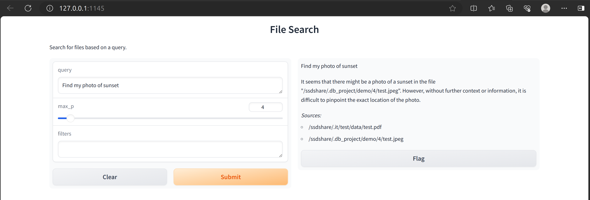

# The Knowledge Database Project

## Usage

1. Start at the `src` folder.
2. Use the makefile to run the program. The targets are:
    - `setup`: Install the required packages.
    - `build`: Build the database provided the path.
    - `add`: (optional) add other books from `data_list.txt` (need to place in `src` folder).
    - `run`: Run the web UI.
    For example, you can run `make setup` to install the required packages.
3. WebUI usage: there are three entries
    - `query`: your question.
    - `max_p`: a model parameter.
    - `filter`: (optional) filter the files based on the path. Only files with path containing `filter` will be searched.

## Supported File Types

- text-based files;
- pdf, docx, pptx files;
- images (also support images with no text, e.g. photos);
- audios and videos.

## Demo

In the demo, the database is built from the `demo` [folder](./demo). There are **68** files in total, including 45 pdf files, 8 image & video files, and 15 other files files.

Here are some example Q&A pairs:

### Standard Q & A

### With the `filter` function

(`filter` function means to only find related files which path contains the given input.)

Can find images or videos based on there context meanings:

I am wgt